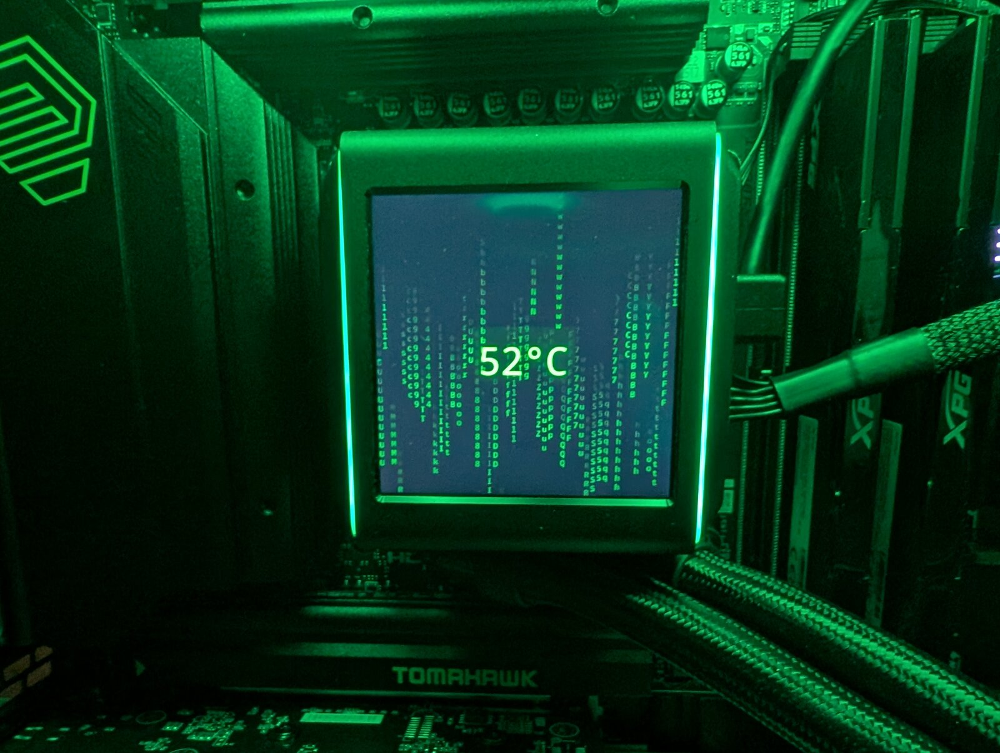

# Lian Li Galahad II LCD Control for Linux

Control the LCD display and RGB lighting on Lian Li Galahad II water cooling pump from Linux.

I could't find a way to control my LCD screen from linux, so I created this tool.

Based on the [gaii-control](https://github.com/bn45hkurr0y4/gaii-control)

**Device:** `0416:7395` Winbond Electronics Corp. LianLi-GA_II-LCD_v1.4



## Features

- Display time, date, CPU temperature, and CPU usage on the pump LCD
- Animated "matrix" preset with nice falling symbols
- Animated "heartbeat" preset for real-time CPU load visualization
- Control RGB light color
- Custom background images (PNG, JPG, etc.) with scaling modes
- Configurable refresh rate
- Semi-transparent overlay for text on backgrounds

## Installation (NixOS)

```bash
# Run directly
nix run .

# Or enter dev shell
nix develop
cargo run -- [OPTIONS]
```


## Installation (Other Linux Distros)

1. Install Rust and Cargo.
2. Install system deps: `sudo apt install libusb-1.0-0-dev pkg-config ffmpeg fonts-noto-core`.
3. Clone repo and build: `cargo build --release`.
4. Install udev rules (see USB Permissions), then run `./target/release/glc [OPTIONS]`.

### USB Permissions

For non-root access, install udev rules:

```bash
sudo cp utils/99-lian-li-galahad.rules /etc/udev/rules.d/
sudo udevadm control --reload-rules
sudo udevadm trigger
# Replug USB device
```

Or add to NixOS `configuration.nix`:

```nix
services.udev.extraRules = ''
  SUBSYSTEM=="usb", ATTR{idVendor}=="0416", ATTR{idProduct}=="7395", MODE="0666", GROUP="users"
'';
```

## Usage

```
glc [OPTIONS]

Options:
  --preset, -p {matrix,heartbeat}  Display preset mode: matrix (falling characters),
                                   heartbeat (animated CPU pulse bar)

Options:
  --rgb, -c COLOR        RGB light color: name, hex (#RRGGBB), or r,g,b
                         Default: #00FFC8 (cyan)
  --fps, -f FPS          Display refresh rate (default: 5)
  --bg, --background PATH
                         Background image file (PNG, JPG, etc.)
  --bg-mode MODE         Background scaling: stretch, fit, fill (default: fill)
  --no-overlay           Disable time/date/CPU overlay (image only)
  --overlay-opacity N    Overlay background opacity 0-255 (default: 180)

Examples:
  glc                      # Default cyan
  glc --rgb blue           # Blue RGB light
  glc --rgb "#00FF00"      # Green RGB (hex format)
  glc --rgb "255,0,0"      # Red RGB (r,g,b format)
  glc --rgb bright_yellow  # Bright yellow RGB light
  glc --bg wallpaper.png   # Background with overlay
  glc --bg photo.jpg --no-overlay  # Image only
  glc --bg logo.png --bg-mode fit  # Fit with black bars
  glc --bg art.png --overlay-opacity 200  # Opaque overlay
  glc --preset heartbeat                 # Animated heartbeat CPU bar
  glc --preset heartbeat --fps 20        # Heartbeat mode with faster animation
```


## Color Names

The `--rgb` / `-c` option now supports human-readable color names in addition to hex and RGB formats.

### Available Colors

**Basic Colors (8):**
- `black`, `red`, `green`, `yellow`, `blue`, `magenta`, `cyan`, `white`

**Bright Colors (8):**
- `gray` / `grey`, `bright_red`, `bright_green`, `bright_yellow`, `bright_blue`, `bright_magenta`, `bright_cyan`, `bright_white`

Color names are case-insensitive, so `blue`, `BLUE`, and `BrIgHt_YeLLoW` all work.

## Scaling Modes

- **stretch**: Resize to exact 480x480 (may distort)
- **fit**: Fit inside 480x480 with black bars (no distortion, may have bars)
- **fill**: Crop to fill 480x480 (no bars, may crop edges)

## Requirements

- Rust-built `glc` binary
- libusb
- ffmpeg for H.264 encoding
- Fonts (noto-fonts recommended)
- fontconfig-compatible system fonts

## Performance Notes

- Rendering and USB packet construction are implemented in Rust.
- H.264 encoding is performed by an external `ffmpeg` process in v1 for packaging reliability.
- CPU stats and image/font resources are cached where practical for smoother animation.

## Troubleshooting

- **USB access denied**: Install udev rules or run with sudo
- **Font not found**: Ensure noto-fonts is installed
- **Background fails**: Check image path and format (PNG/JPG supported)
- **Type errors in diagnostics**: Ignore pyusb warnings (runtime works fine)
